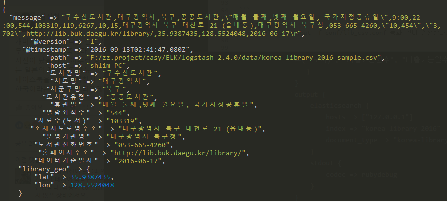
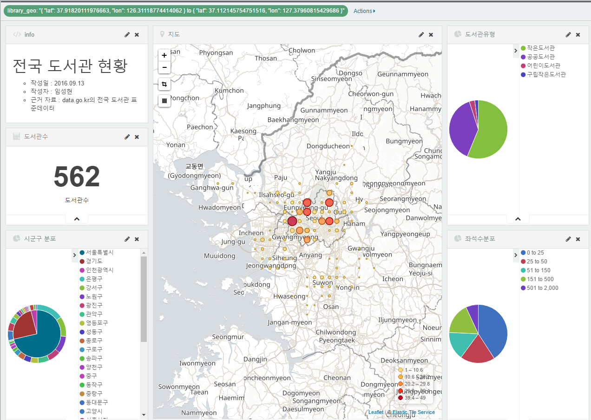

#목적
1. 공공데이터를 활용, 전국 도서관 위치를 가시화 해보려 합니다.
1. 공공데이터에 있는 정보를 바로 사용하기에는 오류가 일부 존재합니다. 이를 수정해보겠습니다.

#작업 내용

[데이터 정제]

1. 다운로드
  - data.go.kr에서 전국 [도서관 표준 데이터](https://www.data.go.kr/subMain.jsp?param=REFUQUdSSURAMTUwMTMxMDk=#/L2NvbW0vY29tbW9uU2VhcmNoL2RhdGFzZXREZXRhaWwkQF4wMTJtMSRAXnB1YmxpY0RhdGFQaz0xNTAxMzEwOSRAXmJybUNkPU9DMDAwMSRAXm9yZ0luZGV4PURBVEFTRVQ=) 의 excel 파일을 다운로드합니다.
2. 분석 결과 다음의 이슈가 있습니다.
  - 특정 데이터의 경우 칼럼 값이 오른쪽으로 넘어간 경우 
  
  - 숫자에 따옴표/ 쉼표 등이 함께 포함되어 있는 경우
  
  - 위치 정보 등 칼럼에 빈 값이 존재하는 경우
  - 특히 휴무일의 경우 따옴표 존재, 쉼표, 근무일과 휴무일이 혼재되어 있어 총 371개의 유형 존재
  
  - 데이터 일부가 쪼개져 있는 경우
  
  - 보이지는 않지만, 숫자 뒤에 SPACE가 존재하는 경우
3. 엑셀에서 일부 수정 -> 구글 시트로 업로드 -> csv로 다운로드 한 뒤 정리 진행
  - 구글시트를 활용하면 한글 인코딩의 문제를 가장 손쉽게 해결할 수 있습니다.

[데이터 업로드]

1. ELK 다운로드/ 설치
  - ElasticSearch(엔진) - Logstash(데이터 수집기) - Kibana(가시화)
  - https://www.elastic.co/kr/ 사이트를 참조해서 설치하세요.
2. 서비스 가동 
  - localhost:5601으로 접근, 서비스 가동 여부를 확인합니다.
3. ElasticSearch에 속성 업로드(속성부터 업로드하는 것을 권장합니다.)
  - 아래 내용을 참조해서 속성을 등록합니다.
  
4. Kibana에서 인덱스를 추가합니다.
  - 여기에는 시간 기준이 따로 없으므로 time based event 체크를 해제합니다.
  
5. Logstash conf 파일 만들기
  - lib_csv.conf 파일을 다음을 참조하여 작성합니다.
   
6. 실행 및 결과
  - bin/logstash.bat -f conf/lib_csv.conf 실행합니다.
  
7. 업로드 결과
  - 모든 내용 업로드되었는지 확인하고, 
  - 위도/경도 값이 없는 정보 등을 제외하고 1,490건 업로드되어 있으면 정상입니다.

[가시화]

1. Visualize 선택
  - Kibana의 상단 메뉴에서 Visualize를 선택하면 새로운 가시화 패널을 만들 수 있습니다.
  - 여기에서 우리는 Markdown widget, Metric, 3개의 Pie Chart와 지도를 사용할 예정입니다.  
  - 패널을 만들면서 주의할 것은 조건 변경 후 상단의 녹색 화살표를 클릭해야 반영된다는 점과 
    작업을 마칠 때마다 우측 상단에 있은 저장 표시를 클릭하고 저장해야 한다는 것입니다.
  
2. Markdown Widget
  - 무슨 내용을 담고 있는지 설명하는 글을 작성합니다.
  
3. Metric 
  - 전체 개수, 필터링 결과에 따른 도서관 개수 등을 표현할 때 사용합니다.
  - 아래와 같이 도서관수를 Count 하도록 구성합니다.
  
4. 도서관 유형 Pie Chart(Terms 기준)
  - 도서관 유형이 작은도서관, 공공도서관, 어린이도서관 등등 어떤 유형인지 확인합니다.
  - 어떤 지역을 제한했을 때  비율이 어떻게 되는지 연결되어서 정보를 제공합니다.
  - Aggeration은 Terms를 선택하고, 원을 도서관유형 기준으로 잘라줍니다.
  - 이때 사용하는 방식인 Terms는, 소수 제한된 유형에 따라 분포되어 있을 때 유용합니다.
  - 기본적으로 다섯 개의 상위 값만 보여주는데, Descendin 정보를 20으로 늘려줍니다.
  
5. 열람좌석수 Pie Chart(Range 기준)
  - 열람 좌석수 기준으로 분포를 확인합니다. 이때, 연속되는 숫자 정보이므로 낱낱이 쪼개는 것보다 
    구간을 설정해서 그 경계 안에 존재하는 값이 얼마나 되는지 확인합니다.
  - 특히 불규칙한 분포일 때(1~25에 많이 몰려있고, 501 ~ 2000 사이는 훨씬 희박할 때, 자유롭게 구성 가능) 유용합니다.
  - Aggeration은 Range를 선택하고 열람좌석수를 기준으로 다음과 같이 Range를 나눠줍니다.
  
6. 시군구 분포 Pie Chart(이중 Pie Chart)
  - 시도 정보와 군, 구 정보를 한 번에 볼 수 있도록 구성한 차트입니다.
  - 시도 정보가 없으면 뒤섞여보일 수 있는 군, 구 정보를 조합해서 제공할 수 있습니다.
  - 위 내용과 거의 유사하고, 아래쪽에 Add sub-buckets를 클릭한 뒤 다시 Split Slices를 클릭하고 확장합니다.
  
7. 지도 생성 
  - 이제 지도를 생성할차례 입니다. 앞에서 인덱스 속성을 잘 주었으면 이 단계에서 큰 문제없이 지도 위에 나타납니다.
    혹시 나타나지 않는다면 데이터 삭제, 인덱스 삭제 후 다시 인덱스 -> 데이터 순서로 업로드해보시기 바랍니다.
  - Geohash, library_geo를 선택합니다. 그리고, Option에서 Scaled Circle Markers를 선택하면 아래와 같이 나타납니다.
  
  - 만약, 밀집도를 보고 싶다고 하면 Options에서 Heatmap 타입으로 설정하고 값을 조절하면 아래와 같은 모습을 확인할 수 있습니다.
  
8. Dashboard를 선택하고 지금까지 작업한 패널들을 올려놓아 조합합니다.
  - 아래 내용은 수도권을 지도에서 선택한 뒤 하위 차트가 함께 연결되어서 정보를 제공한 것을 보여주는 예시입니다.
  

  
[참고]
- logstash conf 파일 : [lib_csv.conf](lib_csv.conf)
- 인덱스 속성 등록
```json
curl -XPUT http://localhost:9200/korea-library-2016 -d '
   {
     "mappings" : {
       "korea-library" : {
          "properties" : {
             "library_geo" : { "type" : "geo_point" },            
             "도서관명" : {"type" : "string", "index" : "not_analyzed" },
             "시도명" : {"type" : "string", "index" : "not_analyzed" },
             "시군구명" : {"type" : "string", "index" : "not_analyzed" },
             "도서관유형" : {"type" : "string", "index" : "not_analyzed" },
             "휴관일" : {"type" : "string", "index" : "not_analyzed" },
             "열람좌석수" : {"type" : "integer" },
             "자료수(도서)" : {"type" : "integer"},
             "소재지도로명주소" : {"type" : "string", "index" : "not_analyzed" },
             "운영기관명" : {"type" : "string", "index" : "not_analyzed" },
             "도서관전화번호" : {"type" : "string", "index" : "not_analyzed" },
             "홈페이지주소" : {"type" : "string", "index" : "not_analyzed" },
             "데이터기준일자" : {"type" : "date" }
          }
       }
     }
   }'
```

- 일괄 데이터 삭제
```json
curl -XDELETE http://localhost:9200/korea-library-2016
```